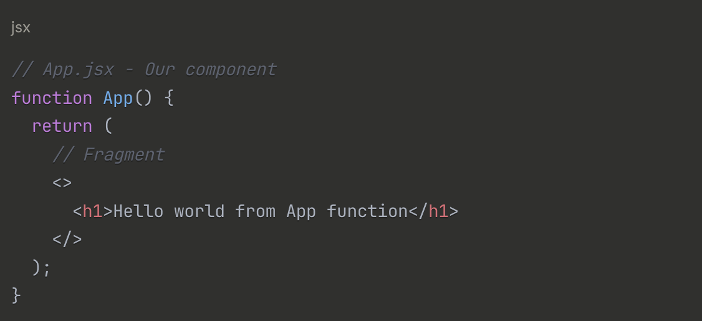
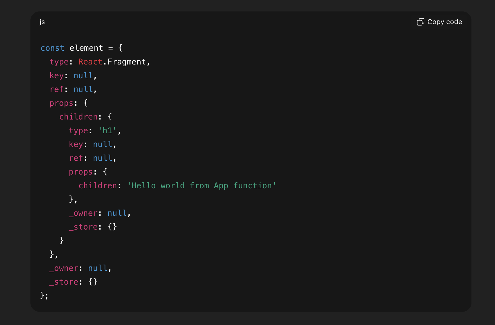
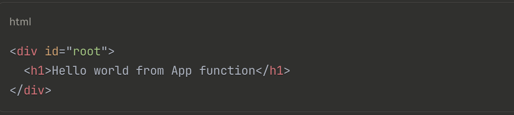

# When we do npm run dev then what happens ?


# 1. npm Checks the package.json File :

  * When you run npm run dev, npm looks into the package.json file in your project and finds the "scripts" section.
  Specifically, it looks for the "dev" key. For example :

  

  * Here, the "dev": "vite" means that running npm run dev executes the vite command. This starts the Vite local development server.


# 2. Vite local Development Server Starts :

  * Vite (or another tool like Webpack or Next.js, depending on your setup) is a modern build tool that starts a local development server. 

  * This server typically runs on a default address like ```http://localhost:5173``` (Vite’s default port) or
  ```http://localhost:3000 ```(common for Next.js or other tools). At this point, Vite is running in the background, ready to handle requests from the browser.


# 3. Browser Requests the URL :

  * When you open your browser and navigate to  ```http://localhost:5173 ``` (or the port Vite is running on), the following happens:

  * Browser Sends a Request to the Local Dev Server through this url :

  * The browser sends an HTTP request to the local development server (e.g., ```http://localhost:5173/```).
    The server responds with the entry point of your application, which is typically an index.html file located in your project’s root or public folder

### This index.html files containes

  * The ```<div id="root"></div>``` is an empty container where your React application will be mounted.

  * The ```<script type="module" src="/src/main.jsx"></script>``` tells the browser to load the main.jsx file, which is the entry point for your JavaScript/React code.

  * The type="module" attribute indicates that the script is an ES Module, allowing modern JavaScript features like import and export.  


# 4. Browser Requests main.jsx :

  * When the browser encounters the ```<script type="module" src="/src/main.jsx">``` tag, it sends a request to the Vite local development server to fetch the main.jsx file. Here’s what happens next:

### Vite local Development server Processes main.jsx:
           
  * main.jsx contains JSX (React’s syntax) and ES Module import statements, which browsers can’t execute directly.

  * Vite transforms main.jsx into executable JavaScript:

  * Converts JSX (e.g., <App />) into React.createElement calls.
    Converts JSX to JavaScript (e.g., <App /> → React.createElement(App)).

  * Resolves import statements (e.g., for react-dom/client and App.jsx).

  * Vite sends this processed JavaScript to the browser as an ES Module.

#### Example of main.jsx before processing:

  

#### Example of main.jsx After Vite’s processing (simplified):

  

### Browser Loads main.jsx:

  * The browser receives the processed JavaScript code and loads it into memory. At this point, nothing is displayed on the screen because the code hasn’t been executed yet.


### Browser Executes main.jsx:

  * The browser runs the JavaScript code line-by-line. This is where createRoot, document.getElementById('root'), and root.render(<App />) come into play.


# 5. Understanding createRoot

## What is createRoot?

  * createRoot is a function from the react-dom/client library (introduced in React 18). It’s used to set up a React root, which is a connection point between your React application and the browser’s DOM.

  * Syntax: ```createRoot(container)``` takes a DOM element (e.g.,```<div id="root">Root Container</div>```) as an argument and returns a root object that React uses to manage rendering.

   * What Does It Do in createRoot(document.getElementById('root'))?

   * document.getElementById('root') is standard JavaScript that finds the ```<div id="root">``` element in the index.html file. For example:


  ``` <div id="root"></div> ```
  

   * createRoot(document.getElementById('root')) tells React: “Use this``` <div id="root">``` as the root container where I’ll render my React application.”

  * It returns a React root object, which has methods like render to control what gets displayed inside ```<div id="root">```.


# 6. What Happens in root.render(<App />)?

* When the browser reaches and executes `root.render(<App />)`, the `render` method of the `root` object is called.  
* This tells React to start the process of rendering the `<App />` component (and its children) inside the root container, which is the HTML element:

  ```html
  <div id="root"></div>
  ```

## When root.render(<App />) is executed:
  
  * root.render(<App />) is executed means root.render(React.createElement(App)) executed. Why? Because when browser requests Vite server to return main.jsx file content, then Vite server first processes main.jsx file and converts it from JSX to JS. root.render(<App />) → root.render(React.createElement(App))

### So when root.render(<App />) executed it means root.render(React.createElement(App)) is executed :

  When browser executes root.render(React.createElement(App)), it creates a React Element object which is basically a JavaScript object describing the component and its props. Then, when root.render() receives that React Element, React sees that the element’s type is a function (App component).

  

  * MAIN STEPS STARTED FROM HERE

### 6.1 React calls the App function to get the JSX it returns. :

  * React calls the App component (from App.jsx), which returns JSX. For example:

  

  the jsx is not understand by browser because it’s not valid JavaScript.
  This JSX is transformed into React.createElement calls by the build tool (like Vite/Babel).

### 6.4 App Component's JSX Gets Converted to React.createElement calls  :

  * The JSX returned by App component also needs to be converted in  React.createElement calls:

  

  * Each React.createElement call creates a React Element object, which is basically a plain JavaScript object describing:

  The type (could be an HTML tag like 'div' or another React component),

  The props (attributes of elements i.e hre , target etc), and

  The children elements or content. of the element of which React Element object is created

  


  ### 6.5 React Creates Virtual DOM

  * React then uses these React Element objects to construct the Virtual DOM tree, which is a lightweight, in-memory representation of the UI.

  The object  = React Element object.
  Many of these objects together (nested) = Virtual DOM tree.
  So they’re not 100% the same, but Virtual DOM is made out of React Elements.

    


  ### 6.6 Virtual DOM to Real DOM Update

  * React uses the Virtual DOM to update the actual DOM inside <div id="root">

 #### Before rendering:

   

 #### After rendering

  


# NOTE


“The Real DOM lives inside the root container (<div id="root">). When root.render() is called, JSX is converted into React Element objects, which form the Virtual DOM. React then uses reconciliation to compare the Virtual DOM with the current Real DOM, and only the necessary changes are applied inside the selected root container of Real DOM.” 

The selected root container is from the Real DOM which React by defualt selected using ReactDom.createRoot() 
with tells that this is where the whole app will be rendered


<!-- const element = {
  type: React.Fragment,
  key: null,
  ref: null,
  props: {
    children: {
      type: 'h1',
      key: null,
      ref: null,
      props: {
        children: 'Hello world from App function'
      },
      _owner: null,
      _store: {}
    }
  },
  _owner: null,
  _store: {}
}; -->
